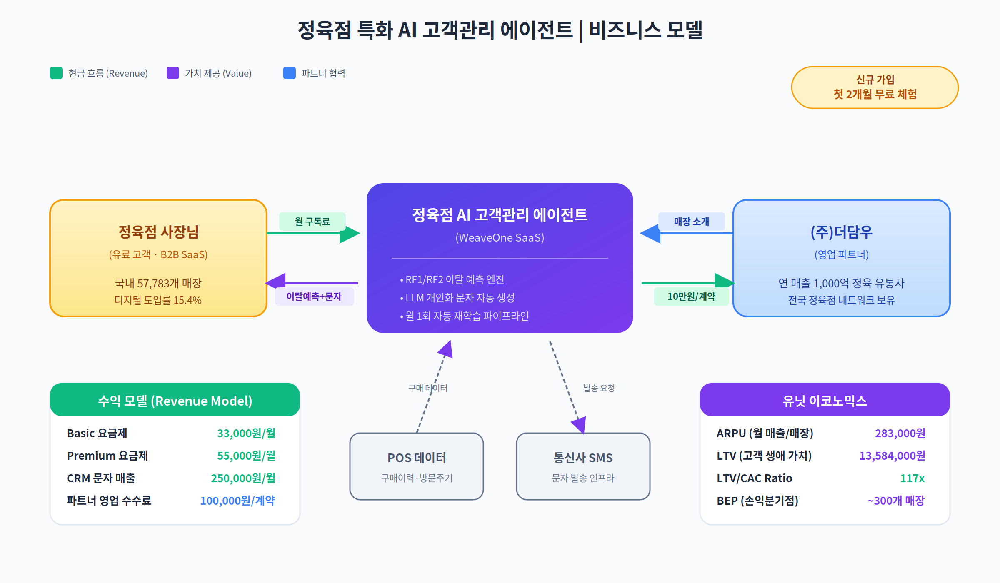

# 사업화·제품화 목표 및 계획

## 1. 사업화 비전

> **"AI 격차 해소 — 소상공인 현장에 최적화된 업종별 AI 고객관리 에이전트"**

- 대기업·중견기업은 AI/CRM 역량 내재화, 소상공인은 기술 접근성·비용·운영 역량 삼중 장벽으로 **AI 활용 구조적 소외**
- 본 사업은 업종별 현장 특성에 최적화된 **버티컬 AI 에이전트**를 연쇄적으로 공급하여 소상공인이 대기업 수준의 고객관리 역량 확보하도록 지원
- 첫 타겟 업종: **정육점** (재방문 주기·객단가 변동 명확, 상품-용도-계절 페어링 체계화 → AI 효용 실증 최적 도메인)

---

## 2. 제품 정의

| 항목 | 내용 |
|------|------|
| 제품명(가칭) | **정육점 특화 AI 고객관리 에이전트** |
| 제품 형태 | 클라우드 기반 SaaS + POS 연동 모듈 |
| 핵심 가치 | "사장님 대신 고객을 기억하고, 매출로 이어지는 문자를 자동 발송하는 AI 점원" |
| 주요 사용자 | 50~60대 정육점 사장님 (디지털 취약계층 포함) |

**핵심 기능**
1. **AI 이탈 예측 엔진** — POS 데이터 기반 RF1/RF2 이중 모델, 고객별 이탈 위험도 자동 산출
2. **LLM 개인화 문자 생성** — 구매 이력·방문 주기·선호 부위 반영 맞춤 문자 자동 작성
3. **자동 발송 및 반응 추적** — 최적 타이밍 발송 후 재방문·재구매 성과 가시화
4. **월 1회 자동 재학습** — 매장별 데이터로 모델 지속 개선

---

## 3. 비즈니스 모델

### 3.1 수익 모델 (Revenue Model)

| 항목 | 단가 | 비고 |
|------|------|------|
| **Basic 요금제** | 33,000원/월 | 이탈 예측 + 문자 생성 + 대시보드 |
| **Premium 요금제** | 55,000원/월 | Basic + 고급 분석 리포트 + 우선 지원 |
| **CRM 문자 매출** | 250,000원/월 | 평균 발송량 기준 |
| **파트너 영업 수수료** | 100,000원/계약 | 더담우 등 파트너가 유치한 매장 |

- **첫 2개월 무료** 체험 후 유료 전환

### 3.2 유닛 이코노믹스

| 지표 | 수치 | 비고 |
|------|------|------|
| ARPU (월 매출/매장) | 283,000원 | 기본료 33,000 + CRM 250,000 |
| LTV (고객 생애 가치) | 13,584,000원 | ARPU 283,000원 × 48개월 유지 |
| CAC (고객 획득 비용) | 116,000원 | 온라인 마케팅 + 파트너 수수료 가중 평균 |
| **LTV/CAC Ratio** | **117x** | 건전 기준(3x 이상) 대비 탁월 |
| BEP (손익분기점) | ~300개 매장 | 정육점 시장 점유율 약 0.5% |

---

## 4. 사업화 로드맵

| 단계 | 기간 | 목표 | 핵심 마일스톤 |
|------|------|------|--------------|
| **1단계** (연구개발·실증) | 2026.7 ~ 2027.10 | 핵심 AI 엔진 개발 및 RCT 검증 | 파일럿 5개 매장, 특허 2~3건 |
| **2단계** (제품화·초기 상용화) | 2027.11 ~ 2028.12 | MVP → 정식 출시, 초기 고객 확보 | 유료 고객 300개 매장, ARR 5억 원 |
| **3단계** (본격 확산) | 2029.1 ~ 2030.12 | 국내 정육점 시장 주도 | 누적 3,000개 매장, ARR 50억 원 |
| **4단계** (산업 확장) | 2031.1 ~ | 타 소상공인 산업 버티컬 확장 | 반찬가게·떡집 등 2개 이상 산업 진출 |

---

## 5. 시장 및 Go-to-Market

| 구분 | 내용 |
|------|------|
| TAM | 국내 정육점 57,783개소 (연 23억 원 잠재 시장) |
| 초기 진입 | 파트너사 (주)더담우 영업 네트워크 활용, 파일럿 5개 매장 → 300개 확장 |
| 확산 전략 | 지역 정육 협동조합 제휴, 정부 소상공인 디지털 바우처 연계, 매장 간 레퍼런스 구전 |
| 산업 확장 | 정육점 → 반찬가게·떡집·수산물·꽃집 등 주기 방문형 소매업 수평 확장 |

---

## 6. 핵심 파트너사

### (주)더담우
- **규모**: 연 매출 약 1,000억 원 정육 유통 전문기업
- **협력 내용**: 초기 파일럿 매장 확보 + 영업 네트워크 활용
- **협력 기반**: 대표 안동철과의 오랜 신뢰 관계
- **발전 방향**: AI 에이전트 개발 완료 후 **주주 참여(전략적 투자)** 협의 중

---

## 7. 예상 사업화 성과

| 구분 | 2027 | 2028 | 2029 | 2030 | 2031 |
|------|------|------|------|------|------|
| 누적 도입 매장 | 5개 | 300개 | 1,200개 | 3,000개 | 5,000개+ |
| 연 매출(ARR) | — | 5억 원 | 20억 원 | 50억 원 | 100억 원 |
| 진출 산업 수 | 1 | 1 | 1 | 1 | 2+ |
| 고용 창출 | 8명 | 15명 | 25명 | 40명 | 60명 |
