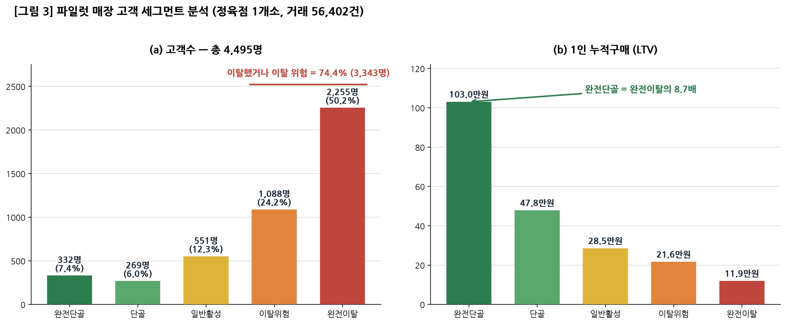
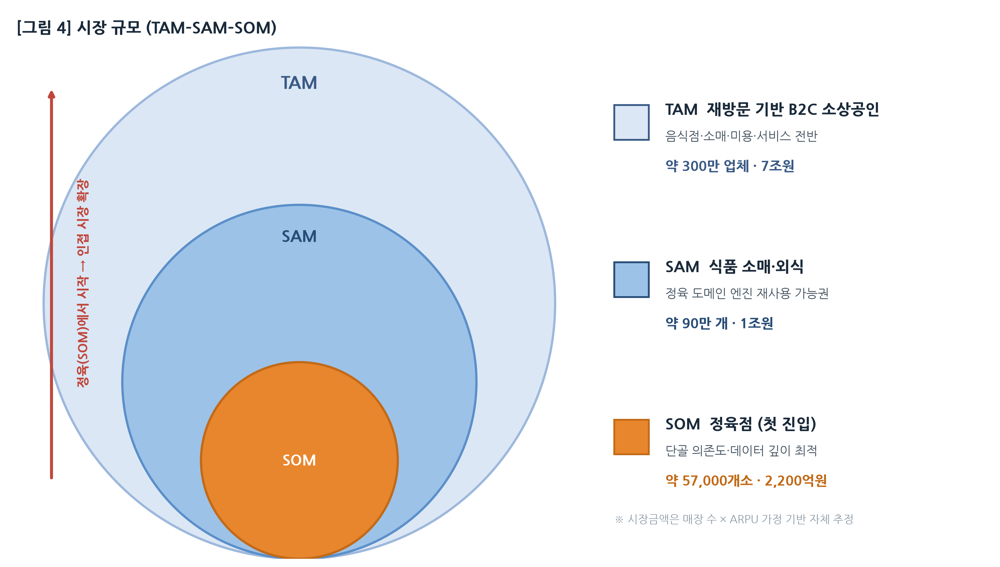
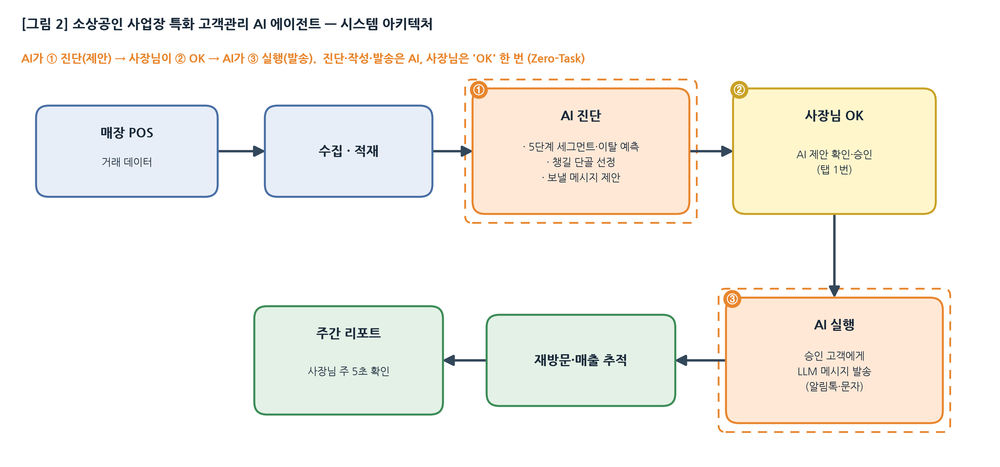

# 예비창업패키지 사업계획서 (PSST) — v0.1 초안

> **창업아이템명**: 소상공인 사업장 특화 고객관리 AI 에이전트
> **신청 사업**: 2026년 예비창업패키지
> **작성일**: 2026.06.22
> **버전**: v0.1 (PSST 양식 초안 — 한글파일 작성 전 파트별 초안)

---

> ⚠️ **작성 메모 (제출 전 확인 필요 — 본문 아님)**
> - 본 문서는 **PSST 4파트 초안**입니다. `[확인]` 영역은 실데이터로 교체 필요.
> - **예비창업패키지 자격**: 신청일 기준 **사업자등록 이력이 없는 예비창업자**가 대상입니다. 본 계획서는 **예비창업자 박동일(대표자)** 기준으로 작성되었습니다. 팀원은 실명 없이 이력만 기재했습니다.
> - **사업비 기준**: 예비창업패키지 **정부지원금 최대 1억원** 기준으로 작성(자기부담금 없음).

---

## ■ 일반현황

| 항목 | 내용 |
|------|------|
| 창업아이템명 | 소상공인 사업장 특화 고객관리 AI 에이전트 |
| 신청 분야 | (IT·SW) 인공지능 / 빅데이터 기반 B2B SaaS |
| 기술 분야 | AI 에이전트, 머신러닝(이탈·수요 예측), 생성형 AI(개인화 메시지) |
| 대표자명 | 박동일 |
| 대표자 생년월일 | 1990.03.25 |
| 예비창업 형태 | 팀 창업 (대표 포함 5명 예정) |
| 팀 구성 인원 | 대표 포함 총 5명 (예정) |
| 사업비 구성(안) | 정부지원금 **1억원** (자기부담금 없음) |

---

## ■ 창업아이템 개요(요약)

| 항목 | 내용 |
|------|------|
| **명칭** | 소상공인 사업장 특화 고객관리 AI 에이전트 |
| **범주(아이템)** | 소상공인(오프라인 매장) 대상 고객관리(CRM)·재방문 마케팅 자동화 SaaS |
| **소개** | 사장님이 손님 응대에만 집중하는 동안, AI 에이전트가 **단골 분류 → 챙길 고객 선정 → 개인화 메시지 작성·발송 → 재방문·매출 추적**까지 **자동으로** 수행하는 *Zero-Task(사장님 행동 ≈ 0)* 고객관리 에이전트. 첫 진입 시장은 **동네 정육점**. |
| **차별성** | ① 사장님 손이 들어가지 않는 **완전 자동화(Zero-Task)** ② 특정 업종(정육)에 깊게 들어간 **수직 도메인 특화**(부분육·계절·명절·가구단위 패턴) ③ POS 거래 데이터만으로 작동(단말 교체 불필요) |
| **목표 고객** | 단골 의존도가 높은 동네 정육점(국내 약 57,000개소) → 식품 소매·외식 등 인접 업종으로 확장 |
| **이미지** | `[확인]` 제품 화면(주간 리포트 1장 / 자동 발송 메시지 예시) 캡처 삽입 |

---

# 1. 문제인식 (Problem)

## 1-1. 창업아이템의 배경 및 필요성

### (1) 추진 배경 — '단골 장사'인데 단골을 모른다

동네 소상공인 매장, 특히 **정육점**은 전형적인 *단골 장사*다. 신규 고객을 한 번 받는 것보다, 한 번 온 단골이 반복 구매하는 구조에서 매출이 나온다. 실제 파일럿 매장의 거래 데이터(고객 **4,495명**·거래 **56,402건**, 누적 매출 약 11.3억원)를 분석하면, **상위 13%의 핵심 단골(601명)이 누적 매출의 약 42%**를 만든다. 반대로 **전체 고객의 74%(3,343명)는 이미 이탈했거나 이탈 위험** 상태다. 즉 매출은 소수 단골에 쏠려 있는데, 그 단골이 빠르게 새어 나가고 있다.

그런데 역설적으로, 매장에는 **그 단골이 누구인지 알 방법이 없다.** 사장님은 아침 장사 준비부터 손질·응대·마감까지 하루를 통째로 매대 앞에서 보낸다. 하루 100명을 응대하면 100명을 잊는다. 매출의 7할을 책임지는 단골이, 정작 매장의 데이터·시스템 어디에도 **'관리 가능한 형태로 존재하지 않는다.'**

동시에 기술 환경은 변곡점을 지났다. LLM(대규모 언어모델) API 비용이 최근 수년 사이 **1/10 이하**로 하락하면서, 매장이 **월 몇 만원** 수준 비용으로도 *고객 분류 → 메시지 작성 → 발송 → 효과 측정*을 자동화할 수 있는 첫 시점이 열렸다. 법률(Harvey)·의료(Hippocratic AI)·영업(11x) 등 *전문 도메인*에는 특화 AI 에이전트가 빠르게 진입했지만, **수백만 동네 자영업 도메인을 겨냥한 특화 AI 에이전트는 아직 사실상 비어 있다.**

> **한 줄 요약**: 매출의 7할이 단골인데, 단골을 관리할 *데이터도·시간도·도구도* 없다. 그리고 그것을 AI로 메울 수 있게 된 것은 *지금*이다.

### (2) 고객 페르소나 — "사장님은 알지만, 못 한다"

| 구분 | 내용 |
|------|------|
| 대상 | 동네 정육점 사장님 (매장 1~3개, 직원 0~2명) |
| 하루 | 새벽 입고·손질 → 종일 매대 응대 → 야간 마감·발주. **고객관리에 쓸 수 있는 시간 ≈ 0** |
| 단골 인식 | "단골이 중요한 건 안다." 그러나 머릿속으로 기억하는 단골은 **약 30명** — 실제 거래 고객(4,495명)의 **1% 미만** |
| 마케팅 | 명절·세일 때 종이 안내문, 또는 메신저 단체발송 — *누구에게 보냈는지·효과가 있었는지 모름* |
| 핵심 통증 | "단골이 떠난 걸 *다른 가게로 옮긴 뒤에야* 안다." |

→ 이 사장님에게 필요한 것은 *더 많은 기능*이 아니라, **'손이 거의 안 가는' 자동 고객관리**다. 의지·정보의 문제가 아니라 **물리적 시간**의 문제이기 때문이다.

### (3) 해결하려는 문제 — 세 가지 구조적 부재

**① 단골 정보가 '사장님 머릿속'에만 있다 (데이터의 부재)**
파일럿 매장 한 곳에서 거래한 고객만 **4,495명**(완전단골 332 / 단골 269 / 일반활성 551 / 이탈위험 1,088 / 완전이탈 2,255). 그러나 사장님이 인지하는 비율은 1% 미만. 매출의 핵심인 단골이 종이 장부·메신저 채널·POS 단편 데이터에 *분산*되어 **통합 조회·검색·통계가 불가능**하다.

**② 단골이 떠나기 전 어떤 신호도 알 수 없다 (감지의 부재)**
방문 주기가 2주에서 6주로 늘어나도, 객단가가 떨어져도 사장님은 모른다. 매장에 **이탈 감지·예측·대응 메커니즘이 전무**하다. 신호를 *데이터로* 보지 못하니, 대응은 항상 *이탈 후*다.

**③ 단골을 관리할 물리적 여유가 없다 (실행의 부재)**
설령 명단이 있어도, 누구에게 무슨 메시지를 언제 보낼지 *매번 사람이 판단·작성·발송*하는 일을 종일 매대에 선 사장님이 감당할 수 없다. 따라서 **사장님 손이 거의 들어가지 않는 완전 자동화(Zero-Task)** 만이 현실적 해법이다.

```
[매출의 70%+ = 단골]
        │
        ▼
 ① 데이터 부재 → 단골이 '보이지 않음'
 ② 감지 부재   → 이탈을 '못 막음'
 ③ 실행 부재   → 관리를 '못 함'
        │
        ▼
  단골을 잃는 줄도 모른 채 매출이 새어 나감
```

### (4) 문제의 규모 — '새어 나가는 매출'의 정량화 *(파일럿 1매장 실측 데이터)*

파일럿 매장의 고객을 방문 빈도·최근성 기준으로 5단계로 나누면, 문제가 *데이터로* 드러난다. *(원본·계산 근거: `research/2026-06_파일럿매장_고객세그먼트.md`)*

| 세그먼트 | 고객수 | 고객 비중 | 1인 누적구매 | 누적 매출(추정) | 매출 비중 |
|---------|------:|------:|----------:|-----------:|------:|
| 완전단골 | 332명 | 7.4% | 1,030,152원 | 약 3.42억 | 30.2% |
| 단골 | 269명 | 6.0% | 478,364원 | 약 1.29억 | 11.4% |
| 일반활성 | 551명 | 12.3% | 284,890원 | 약 1.57억 | 13.9% |
| 이탈위험 | 1,088명 | 24.2% | 216,459원 | 약 2.36억 | 20.9% |
| 완전이탈 | 2,255명 | 50.2% | 119,040원 | 약 2.68억 | 23.7% |
| **전체** | **4,495명** | 100% | 평균 객단가 20,063원 | **약 11.3억** | 100% |


> [그림 3] 제출용 이미지: `assets/segment_chart.png`(300dpi) / 편집용: `assets/segment_chart.svg`

**이 표가 말하는 세 가지**

1. **매출은 소수 단골에 쏠려 있다** — 상위 13.4%(완전단골+단골 601명)가 누적 매출의 **약 42%**. 이 단골을 지키는 것이 곧 매출 방어다.
2. **이미 절반이 떠났고, 1/4이 떠나는 중이다** — 완전이탈 50.2% + 이탈위험 24.2% = **74.4%(3,343명)**. 그런데 사장님은 이 사실을 *데이터로 본 적이 없다.*
3. **단골 1명의 가치는 이탈 고객의 8.7배** — 완전단골 1인 누적 103만원 vs 완전이탈 11.9만원. 활성·위험 고객을 단골로 *끌어올리는* 것의 잠재가치가 매우 크다.

**회복 시나리오 (가설)**: 이탈위험 1,088명 중 **20%(약 218명)**를 단골 수준으로 전환하면, 1인 누적구매 격차(+261,905원) 기준 약 **+0.57억원**의 추가 매출 잠재. 본 아이템은 이 누수를 **이탈 예측 + 자동 대응**으로 막고, 활성 고객을 단골로 키우는 것을 1차 가치로 삼는다. *(전환율·효과의 실측은 §3-2 검증 로드맵 Stage 1에서 확정)*

### (5) 필요성 요약

> 단골이 매출의 7할인데도 단골을 *볼 수도·지킬 수도·챙길 수도* 없는 소상공인에게 — **AI가 대신 고객을 관리해 주는** 솔루션이 필요하다. ① 문제는 5.7만 정육점 + 식품 소매·외식 90만 곳에 걸쳐 보편적이고, ② AI 운영 비용이 충분히 낮아져 *지금* 사업화가 가능하며, ③ 아직 이 자리를 차지한 *업종 특화·완전 자동화* 사업자가 없다.

---

## 1-2. 창업아이템 목표시장(고객) 현황 분석

### (1) 시장 규모 (TAM–SAM–SOM)

본 아이템의 시장은 *재방문(단골) 기반으로 매출이 발생하는 오프라인 소상공인* 전반이며, 정육점을 **첫 진입(beachhead) 시장**으로 삼아 단계적으로 확장한다.

| 단계 | 정의 | 규모(추정) | 산출 논리 |
|------|------|-----------|----------|
| **TAM** | 재방문 기반 B2C 소상공인 (음식점·소매·미용·서비스) | 약 **300만 업체 / 7조원** | 약 300만 매장 × 연 ARPU 약 100만원(구독+발송) |
| **SAM** | 식품 관련 소매·외식 (1차 확장권) | 약 **90만 개 / 1조원** | 식품 도메인 데이터·메시지 톤 재사용이 가능한 인접 업종 |
| **SOM** | 정육점 (첫 진입 시장) | 약 **57,000개소 / 2,200억원**[^1] | 5.7만 매장 × 연 ARPU 약 100~120만원 |

*(TAM·SAM·SOM 매장 수는 통계청 KOSIS 서비스업조사 식육소매업 분류[^1] 및 자체 추정. 시장금액은 매장 수 × ARPU 가정 기반 자체 추정)*


> [그림 4] 제출용 이미지: `assets/market_tam_sam_som.png`(300dpi) / 편집용: `assets/market_tam_sam_som.svg`

> **단계 진입 논리**: 정육은 ① 단골 의존도가 가장 높고(매출 70%+), ② 부분육·계절·명절 등 *데이터 특화 깊이*가 커 후발 모방이 어렵고, ③ 협력 유통사 영업망으로 *초기 침투가 빠른* 시장이다. 정육에서 데이터·운영 자산을 쌓은 뒤, 같은 엔진을 식품 소매·외식으로 *수평 복제*한다.

### (2) 목표 고객 세그먼트 및 진입 순서

| 세그먼트 | 특성 | 규모 | 진입 시점 | 비고 |
|---------|------|------|---------|------|
| **동네 정육점 (1차)** | 매장 1~3개, 단골 의존도 70%+, 직원 0~2명 | 약 57,000개소 | 1~3년차 | beachhead |
| 마트·반찬가게·청과 등 | 식품 소매·외식, 동일 단골 구조 | 약 90만 개 | 4년차~ | 엔진 재사용 |
| 미용·서비스 등 재방문 B2C | 예약·재방문 기반 | 약 200만 개 | 장기 | 톤·주기 재학습 |

### (3) 목표시장 현황 — 디지털 전환은 '하고 싶지만 못 하는' 상태

- **낮은 디지털 전환율**: 동네 자영업 매장의 다수가 여전히 종이 장부·기억·단체발송에 의존. 고객관리(CRM)를 *시스템으로* 하는 비율은 극히 낮음 — **미충족 수요(unmet need)가 큼.**
- **높은 폐업·경쟁 압력**: 소상공인의 생존율은 낮고, 신규 고객 획득 비용은 계속 오른다. → *기존 단골을 지키는 것*의 ROI가 신규 유치보다 높아지는 구조.
- **대형 수평 SaaS의 미진입**: 결제·장부·일반 CRM은 대형 사업자가 점유했지만, *정육 단골 패턴·부분육·명절 메시지* 같은 **수직 도메인 깊이는 비어 있음.**

### (4) 시장 성장 근거 (Why Now)

- **AI 활용 비용 하락**: 프런티어 LLM의 토큰 단가가 2023년 이후 **90% 이상 하락**(예: GPT-4 100만 토큰 $30 → GPT-4o $4 수준)[^3] → 매장 단위에서도 풀스택 AI 자동화가 *경제성*을 갖춘 첫 시점.
- **AI 에이전트 시장 급성장**: 글로벌 AI 에이전트 시장 2024년 약 **54억 달러 → 2030년 약 503억 달러(CAGR 45.8%)**[^4]. 그러나 법률·의료·영업 등 전문 도메인에는 특화 AI가 진입한 반면 **소상공인 버티컬은 0개사에 가까움.**
- **정육 소비 회복**: 1인당 연간 육류 소비(4대 육류)가 2018년 약 53.9kg → 2023년 약 **62.9kg**(5년 +약 16%)[^2] — 기존 매장 단골 ROI 상승.
- **정부 정책 순풍**: 중소벤처기업부·소상공인시장진흥공단의 소상공인 디지털 전환(스마트상점·바우처 등) 정책[^5] — AI SaaS의 직접 도입 매칭 채널로 작동. *(대상 규모·예산은 연도별 공고 기준 `[확인]`)*

### (5) 경쟁·대체재 현황 (요약 — 상세 §2-2)

| 대체재 | 현재 위치 | 한계 |
|--------|----------|------|
| 종이 장부 / 사장님 기억 | 대다수 매장 | 단골의 1~2%만 관리, 통계·검색 불가 |
| 메신저 단체발송 | 일부 매장 | 개인화·효과측정·업종 특화 없음 |
| 대형 수평 SaaS(결제·장부·일반 CRM) | 전 자영업 점유 | 정육 도메인·완전 자동화(Zero-Task) 부재 |
| 종합 POS 단골 모듈 / 본사 가맹형 | 일부 | 단말 교체비(300~500만원) / 동네 매장 진입 불가 |

→ **'진입 비용이 낮고 + 업종 특화이며 + 사장님 손이 거의 안 드는'** 솔루션의 교집합이 시장에 *없다*. 이 공백이 본 아이템의 자리다.

### (6) 고객 인용 (현장)

> *"단골이 누군지 알면 매출이 다른데, 하루 100명 보면 다 잊어버립니다."*
> — `[확인]` 파일럿 매장 사장님 (실명/매장명 동의 후 교체)

---

# 2. 실현가능성 (Solution)

## 2-1. 창업아이템의 현황 (준비 정도)

### (1) 개발 단계 — 'PoC를 넘어 실매장 가동' 단계

본 아이템은 아이디어·기획 단계가 아니라, **실제 매장에서 핵심 워크플로가 돌아가고 있는** 단계다. 즉 *"되는지 모르는 것을 만드는"* 사업이 아니라, *"되는 것을 측정·확장하는"* 사업이다.

| 구성요소 | 개발 현황 | 비고 |
|----------|----------|------|
| POS 거래 수집 | ✅ 가동 | 파일럿 매장 거래 실시간 적재 |
| 단골 자동 분류 | ✅ 가동 | 방문빈도·최근성 기반 5단계 세그먼트 자동 산정 |
| 개인화 메시지 자동 생성 | ✅ 가동 | 정육 말투·부위·관계 톤 매핑 |
| 메시지 발송(문자) | ✅ 가동 | 발송 채널 연동 |
| 재방문·매출 추적 | 🔧 구축 중 | **본 사업의 효과 측정 인프라 대상** |
| 이탈 예측 모델 | 🔧 고도화 예정 | 룰 기반 → ML 모델로 정밀화 |
| 재고 분석·발주 제안 | 🔜 개발 예정 | 축 2·3 (사업 후반/후속) |

### (2) 작동 증거 (실측 데이터)

**정육점 1개소 파일럿 가동 중** (2024.04~)
- 단골 자동 분류 → 메시지 자동 생성 → 발송의 **전 과정 워크플로가 실제 매장에서 작동**
- 누적 거래 **56,402건**, 분석 고객 **4,495명**을 5단계 세그먼트(완전단골~완전이탈)로 자동 분류 — 누적 매출 약 11.3억원 규모
- 사장님이 제품을 **일상적으로 사용 중** (지속 사용 = 1차 유용성 신호)

### (3) 아직 측정되지 않은 것 (정직한 공개)

| 미측정 항목 | 상태 | 검증 시점 |
|------------|------|----------|
| 도입 전/후 매장 매출 차이 | 측정 시작 전 | Stage 1 (Q1) |
| 알림 발송 → 재방문 전환율 | 측정 시작 전 | Stage 1 (Q2) |
| 고이탈 단골 잔존 효과 | 측정 시작 전 | Stage 1 (Q3) |
| 제품 가치 가설(매출 +15% / 비용 -50%) | 실증 데이터 없음 | Stage 1~2 |

→ 위 항목이 **본 사업 기간의 핵심 검증 목표**다(§3-2). 본 사업은 *제품을 처음부터 만드는* 것이 아니라 **이미 가동 중인 워크플로의 효과를 측정·검증하고 다수 매장으로 확장**하는 단계 — *예비창업 단계에서 보기 드문 '실증 출발점'*을 이미 확보했다.

### (4) 보유 역량 / 자산

| 자산 | 내용 | 경쟁상 의미 |
|------|------|------------|
| 가동 중인 제품 워크플로 | POS→분류→메시지→발송→추적 | 즉시 확장 가능, 개발 리스크↓ |
| 정육 도메인 데이터 | 부분육·계절·명절·가구단위 패턴 (거래 56,402건·고객 4,495명) | 후발 모방 난이도↑ (데이터 해자) |
| 협력 유통사 영업망 | 연 매출 약 1,000억 정육 유통사 — 초기 5개 점포 영업 합의 | 베타 매장 확보 채널 확보 |
| 팀 역량 | B2B SaaS 0→1 + AI/데이터 박사급 + 도메인 자문 | 실행·기술·현장 3축 |

---

## 2-2. 창업아이템 실현 및 구체화 방안

### (1) 제품 개요 — Zero-Task AI 에이전트

**사장님의 행동 횟수 ≈ 0**을 목표로 하는 AI 에이전트다. 사장님이 눈앞의 손님에게만 집중하는 동안, AI가 **동시에** 단골·재고·이탈을 챙긴다 — *알아서 다 해주는 보이지 않는 막내 직원*.

### (2) 작동 방식 — *AI 진단 → 사장님 OK → AI 실행* (사장님은 'OK'만)

1. **앱 설치 + POS 연동** (5분, 1회성) — 발송 정책 사전 설정(안전 가드레일)
2. **단골 명단 자동 누적** — POS 거래가 들어올 때마다 고객·구매 부위·금액 자동 분류
3. **① AI 진단** — *지금 누구에게 어떤 메시지를 보내면 좋을지* AI가 판단해 **챙길 단골 선정 + 보낼 메시지(LLM 초안)를 제안**
4. **② 사장님 OK** — AI 제안을 확인하고 **승인(탭 1번)**. 사장님은 진단·작성을 하지 않고 *승인만*
5. **③ AI 실행** — 승인 즉시 **해당 고객들에게 LLM 개인화 메시지 발송** (알림톡/문자)
6. **재고 분석·이탈 예측도 동일 흐름** — 과재고 부위 프로모션·이탈 임박 쿠폰을 *진단 → OK → 실행*으로 처리
7. **재방문·매출 자동 추적 → 주간 리포트 1장** (사장님은 주 5초만 확인)

> ※ '사장님 OK' 승인 게이트를 둠으로써 *완전 자동발송 대비 발송 민원·오발송 리스크를 낮추면서도*, 진단·메시지 작성·발송 부담은 모두 AI가 진다(=Zero-Task).

### (3) 핵심 기능 — 3축

- **축 1. 데이터 기반 단골 관리**: POS 거래 → 단골 자동 분류(5회+ 단골 등급) → AI 자동 선정 → 개인화 메시지 발송 → 이탈 예측·자동 쿠폰 → 주간 리포트.
- **축 2. 재고 기반 마케팅**: 과재고 부위 자동 프로모션, 신선도 기반 추천, 마케팅 ROI 자동 측정.
- **축 3. 판매 예측 기반 발주 제안**: 단골 패턴 + 계절·명절 변수 → 발주량 자동 산정, (장기) 도매 연동 자동 발주.

### (4) 기술 구현 방안 — 아키텍처 & AI 파이프라인

**(가) 시스템 아키텍처 (개요)** — *제출용 이미지: `assets/architecture_diagram.png`*



```
[매장 POS] ──거래 데이터──▶ [수집/적재]
                                │
                                ▼
                    [단골 분석 엔진]
              ├─ 단골 분류(방문빈도·객단가·부위 선호)
              ├─ 이탈 예측 모델(방문주기 이상 감지)
              └─ 챙길 단골 자동 선정
                                │
                                ▼
                  [LLM 메시지 생성 + 안전 가드레일]
              ├─ 정육 말투·부위·관계 톤 매핑
              └─ 발송 정책 검증(빈도·시간·금칙)
                                │
                                ▼
        [발송: 알림톡/문자] ──▶ [재방문·매출 추적] ──▶ [주간 리포트]
```

**(나) 핵심 기술 스택**

| 영역 | 스택 |
|------|------|
| 모바일 | React Native (iOS·Android 단일 코드베이스) |
| 추천/예측 엔진 | 단골 행동 시계열 분석 + 이탈 예측 ML 모델 |
| 메시지 생성 | LLM 기반 개인화 생성 + 정육 도메인 프롬프트·가드레일 |
| 발송 인프라 | 카카오 알림톡 · LMS · 이메일 다채널 |
| 백엔드 | Python/FastAPI + PostgreSQL + Redis |
| 장기 확장 | POS·카드사 API, 도매 API 연동, 데이터 라이선스 |

**(다) 핵심 기술 차별점 (구현 관점)**
- **이탈 예측**: 단순 룰(N일 미방문)에서 → *개인별 방문 주기 분포* 기반 이상 감지로 고도화. "이 단골에게 6주는 정상, 저 단골에겐 위험" 을 개인화.
- **정육 특화 메시지 생성**: 부분육(목살·삼겹·등심)·용도(구이·찌개·선물)·관계 톤을 매핑한 *도메인 프롬프트*. 범용 LLM이 만들 수 없는 "정육점 사장님 말투".
- **Zero-Task 안전 가드레일**: 사장님 검토 없이 자동 발송하므로, *발송 빈도·시간대·금칙어·중복 방지* 정책 엔진이 핵심 신뢰 자산. (업종별 누적이 후발 진입장벽)

### (5) 개발·구체화 로드맵 (협약기간 약 8개월)

| 시기 | 마일스톤 | 주요 개발/검증 내용 |
|------|---------|----------|
| M1~M2 | 효과 측정 인프라 | 재방문·매출 추적 모듈, 매장별 대시보드, 도입 전/후 비교 설계 |
| M3~M4 | 파일럿 효과 데이터 | 파일럿 1매장 도입 전/후 매출·재방문 데이터 정리(Stage 1) |
| M3~M6 | 베타 확장(N=30) | 협력사 5매장 + 베타 25매장 온보딩, 발송 안정화 |
| M5~M6 | AI 고도화 | 이탈 예측 모델 v1, 메시지 생성 품질 개선 |
| M7~M8 | PMF 1차 검증 | 가격·유료 전환 테스트, ROI 대시보드, 성과 정리 |

> 재고 분석(축 2)·발주 제안(축 3)은 본 협약기간 이후 후속 단계로 분리.

### (6) 실현 리스크 및 대응

| 리스크 | 대응 |
|--------|------|
| POS사별 데이터 연동 편차 | 우선 *수기/영수증·범용 연동* 경로 확보 → 주요 POS사 PoC 병행 |
| 자동 발송 품질·민원 | 안전 가드레일(빈도·시간·금칙)·발송 정책 사전설정, 초기엔 사장님 승인 옵션 제공 후 점진적 자동화 |
| 효과 미검증 리스크 | Stage 게이트로 *조기 측정*, 실패 시 가격·세그먼트 재설계 또는 피벗 |
| 개인정보·발송 규제 | 수집·발송 동의 체계, 정보통신망법·개인정보보호법 준수 설계 |

### (7) 차별화 / 경쟁 우위

자영업 SaaS는 *수평 카테고리*(전 업종 공통 결제·장부·일반 CRM)와 *수직 카테고리*(특정 업종 깊이)로 갈린다. **수평은 이미 대형 사업자가 점유**하고 있으나, **'수직 업종 특화 × 완전 자동화(Zero-Task)' 영역은 비어 있다.**

| 차별점 | 종류 | 시간이 갈수록 |
|--------|------|--------------|
| 정육 도메인 학습 데이터(부분육·계절·명절·가구단위) | 데이터 해자 | 누적될수록 격차 확대 |
| Zero-Task 운영 자산(발송 정책·안전 가드레일·예외 케이스) | 운영 해자 | 데이터+운영 시간이 함께 쌓인 회사만 가능 |
| 사장님 직접 가입(POS 교체 불필요) | 구조 차별 | 수평 SaaS의 단가 ROI 불성립 |
| 동네 클러스터 침투 + 사장님 추천 | 네트워크 효과 | 일정 침투 후 후발 영업비 급증 |

> **왜 대형 수평 SaaS·대기업이 못 하는가**: ① 동네 매장 ARPU(월 약 10만원)는 대기업 영업 인건비 ROI가 성립하지 않음 ② 부분육 단가·신선도·단골 패턴은 정육 특화 데이터 없이 못 만듦 ③ 동네 사장님은 대기업에 데이터를 주는 것에 민감 — 작은 회사의 수직 동맹이 침투에 유리.

---

# 3. 성장전략 (Scale-up)

## 3-1. 비즈니스 모델 및 사업화 추진 전략

### (1) 수익 모델 — 월 구독 + 발송 과금 (+ 장기 유통 중개)

| 수익원 | 단가 | 비고 |
|--------|------|------|
| Basic 구독 | 월 33,000원 | AI 고객관리 전 기능 |
| 메시지 발송 | 건당 33원 | 매입가 대비 마진 포함 |
| 유통 매입·중개 | (장기) | 도매 ↔ 매장 연결 수수료 |

- **예상 ARPU(매장 월)**: 약 **8~12만원** = 구독 33,000원 + 발송 평균 1,500~2,500건 × 33원
- **가격 산정 근거**: 베타 사장님 인터뷰 기반, *알바생 시급 1~2시간 분량*으로 부담 수준 검증.
- **제품 가치 가설**: 매장 매출 **+15%** / 마케팅·재고비 **-50%** *(목표치 — 현재 실증 데이터 없음, 본 사업 Stage 1에서 실측)*

### (2) 단위 경제(Unit Economics) *(가설 — 베타 누적 후 확정)*

| 지표 | 목표(가설) | 업계 기준 |
|------|-----------|----------|
| Gross Margin | 75~80% | SaaS 전형 |
| CAC (고객획득비용) | 5~9만원 | 채널 믹스 기준 |
| 월 이탈률 | 3~5% | SMB SaaS 평균 5~7% |
| LTV / CAC | 5배+ | 3배+ 권장 |
| 회수 기간(Payback) | 1~3개월 | <12개월 권장 |

> ⚠️ 위 수치는 *N=1 단계의 가설*. 본 사업의 Stage 1~3(Q1~Q10)이 곧 이 값들을 **실측으로 대체**하는 과정이다.

### (3) 시장 진입(GTM) 채널 믹스

| 채널 | 비중 | 설명 | 본 사업기간 역할 |
|------|:----:|------|----------------|
| 직판(웹·전화·방문) | 30% | 자체 영업 | 초기 베타 직접 확보 |
| 파트너 유통사 | 20% | 정육 유통사 영업망(초기 5개 점포 합의) | **베타 5매장 즉시 투입** |
| POS사 협업(매출 쉐어) | 20% | 정육 POS 1~2사 | PoC 접촉 시작 |
| 조합·협회 제휴 | 10% | 정육협동조합·한우자조금 등 | 신뢰·확산 채널 타진 |
| 정부 바우처 | 20% | 소상공인 디지털 전환 바우처 | 도입비 보조로 전환율↑ |

### (4) 단계별 사업화 전략

| Phase | 기간 | 목표 | 핵심 활동 |
|-------|------|------|----------|
| **Phase 1** | 본 사업기간(~8개월) | 효과 검증 + 베타 30매장 | 파일럿 효과 측정 → 협력사 5 + 베타 25 → 유료 PMF 1차 |
| **Phase 2** | 후속 ~18개월 | 유료 100~150매장, 공헌이익 양수화 | 가격 GTM, POS 연동, 바우처 채널 가동 |
| **Phase 3** | 3년차~ | 정육 시장 주도 → 인접 업종 확장 | 데이터 라이선스·유통 중개·식품 소매 복제 |

### (5) 시장 진입 성과 목표 (정량)

| 지표 | 사업 종료(M8) | +1년 | +3년 | +5년 |
|------|:----:|:----:|:----:|:----:|
| 도입 매장(누적) | **30**(베타) | 100~150 | 600~1,000 | 5,000+ |
| 유료 전환율 | 1차 측정 | 60%↑(목표) | — | — |
| ARR | — | 약 1~1.5억 | 약 8~13억 | 약 100억+ |
| 매장당 매출 효과 | **+10%↑ 실측 목표** | +15%(가설) | — | — |
| 누적 고용 | 5명 | 10명 | 15명 | 40명 |

> ※ 모든 수치는 가설/목표이며, *사업 종료 시점(M8)의 1차 책임 지표*는 **① 파일럿 매출 효과 실측 ② 베타 30매장 온보딩 ③ 유료 전환 1차 데이터**다.

---

## 3-2. 생존율 제고를 위한 노력 (검증 로드맵)

본 아이템의 모든 매출·잔존·확장 수치는 *아직 N=1 워크플로 가동 단계*의 **가설**에서 출발한다. 따라서 본 사업은 *제품을 만드는* 자금이 아니라 **핵심 가설에 '측정된 답'을 확보하는** 자금으로 설계한다. 각 단계 통과/실패에 따라 **확장 / 가격 재설계 / 피벗** 의사결정 게이트가 작동한다 — 이것이 곧 생존율 제고 전략이다.

### Stage 1. 가설 검증 (0~6개월)

| # | 검증 질문 | 측정 방법 | 통과 기준(가설) |
|---|------|---------|------|
| Q1 | 파일럿 1매장 도입 전/후 매출 차이? | 도입 6개월 전후 월매출 비교(POS) | 월매출 +10%↑ |
| Q2 | 알림 1건 → 재방문 전환율? | 발송 14일 내 재방문 트래킹 | 전환율 8%↑ |
| Q3 | 고이탈 단골을 실제로 살리는가? | 이탈 4분위별 7·14·30일 잔존율 | 임박군 잔존 +20%p↑ |

→ 통과 시 Stage 2 / 실패 시 **제품 피벗 검토**

### Stage 2. PMF 찾기 (6~12개월)

| # | 검증 질문 | 측정 방법 | 통과 기준(가설) |
|---|------|---------|------|
| Q4 | 30매장에서도 효과 재현되는가? | N=30 매장별 효과 분포 | 70%↑ 매장이 매출 +5%↑ |
| Q5 | 유료 전환율은? | 무료 3개월 후 결제 비율 | 유료 전환 60%↑ |
| Q6 | 매장당 발송량 분포는? | 매장별 월 발송 건수 | 평균 1,500건↑, 분포 안정 |

→ 통과 시 Stage 3 / 실패 시 **가격·세그먼트 재설계**

### Stage 3. 공헌이익 양수화 (12~18개월)

| # | 검증 질문 | 측정 방법 | 통과 기준(가설) |
|---|------|---------|------|
| Q7 | 파트너 영업망 효율? | 점포당 도입 소요 인일 | 점포당 5인일 이내 |
| Q8 | 직판 CAC? | 채널별 영업비 / 신규 매장 | 5~9만원 |
| Q9 | 실제 ARPU? | 매장별 월 실수금 | 월 8~12만원 |
| Q10 | 월 이탈율 / LTV? | 코호트 잔존 추적 | 월 이탈 5%↓ / LTV·CAC 5배+ |

→ 통과 시 **다음 라운드(후속 투자) 도전** / 실패 시 브릿지·피벗

### 의사결정 게이트

| 시점 | 단계 | 통과 시 | 실패 시 |
|------|------|---------|---------|
| +6m | Stage 1 | 베타 확장 가속 | 제품 피벗 검토 |
| +12m | Stage 2 | 본격 유료 GTM·POS 연동 | 가격·세그먼트 재설계 |
| +18m | Stage 3 | 후속 투자 도전 | 브릿지 라운드 / 피벗 |

---

## 3-3. 사업 추진 일정 및 자금 운용 계획

### (1) 사업 추진 일정 (협약기간 약 8개월 기준)

> 예비창업패키지 협약기간(통상 당해연도 ~ 약 8개월)에 맞춰, **본 사업 기간의 목표는 §3-2 Stage 1(가설 검증) 완주 + Stage 2(PMF) 진입**으로 한정한다. 이후 단계는 후속 사업으로 분리.

| 추진 내용 | M1–M2 | M3–M4 | M5–M6 | M7–M8 |
|-----------|:----:|:----:|:----:|:----:|
| 효과 측정 인프라 구축 | ● | ● | | |
| 파일럿 1매장 도입 전/후 효과 데이터 정리 | | ● | ● | |
| 협력사 5매장 + 베타 확장(누적 N=30) | | ● | ● | ● |
| AI 추천·발송 기능 고도화 | | ● | ● | ● |
| 유료 전환·가격 PMF 1차 검증 | | | ● | ● |
| 성과 정리 및 후속 사업화·투자 준비 | | | | ● |

**사업 종료 시점(M8) 목표 산출물**: 효과 데이터(매출 +%·재방문 전환율) N=30매장, 유료 전환 1차 지표, 후속 GTM/투자 계획.

### (2) 정부지원사업비 집행 계획 (정부지원금 1억원 기준)

> 예비창업패키지 정부지원금 **최대 1억원**(자기부담금 없음) 기준 비목 구성(안). 실제 집행 시 사업 운영지침의 비목·한도(특히 대표자 본인 인건비 불가 등)를 준수해 재조정. `[확인]`

| 비목 | 금액(원) | 비중 | 주요 용도 |
|------|--------:|:----:|----------|
| 외주용역비 | 35,000,000 | 35% | AI 모델·POS 연동·발송 인프라 외주 개발 |
| 광고선전비(마케팅) | 25,000,000 | 25% | 베타 매장 확보, 정육 협회·바우처 채널 홍보 |
| 인건비(직원) | 15,000,000 | 15% | 개발·운영 인력 인건비(규정 범위 내) |
| 지급수수료 | 10,000,000 | 10% | 전문가 자문·서버/SW 이용료·발송비 |
| 재료비·기계장치 | 8,000,000 | 8% | 측정·테스트 기기, 데이터 수집 |
| 창업활동비·여비 등 | 7,000,000 | 7% | 시장조사·출장·기타 운영 |
| **합계** | **100,000,000** | **100%** | **정부지원금 1억원** |

### (3) 정부지원금 외 자금 확보 계획

- 예비창업패키지는 **자기부담금이 없으므로**, 본 사업은 정부지원금 1억원으로 Stage 1~2 검증에 집중.
- **후속 자금 연계**: 사업 종료 후 ① 정부 R&D(디딤돌 등) ② 민간 초기투자(Pre-Seed) ③ 매출(유료 전환) 자체 운영자금으로 18개월 검증 로드맵 잔여 단계 추진.

---

# 4. 팀 구성 (Team)

## 4-1. 대표자 및 팀 역량

### (1) 대표자 (예비창업자)

| 항목 | 내용 |
|------|------|
| 성명 | **박동일** |
| 생년월일 | 1990.03.25 |
| 학력 | 회계학 전공 (학사) |
| 주요 경력 | 사업 운영·재무·회계 관리 |
| 담당 | 대표 — 경영·재무·자금 집행 총괄, 대외 협력 |
| Founder–Market Fit | 운영·재무 관리 역량으로 초기 팀의 **사업 실행·자금 운용 안정성** 확보. 정육 도메인 협력 네트워크를 통해 현장 시장에 직접 접근. |

### (2) 팀원 (예정) — 이력 기준

> ※ 합류 형태(공동창업자/직원/자문)는 협약 시점에 확정. 아래는 **실명 없이 역량·이력만** 기재.

| 직책 | 주요 이력·역량 | 담당 |
|------|----------------|------|
| 제품·기술 총괄 | B2B SaaS 기업 **CTO 약 8년** — SaaS 제품 0→1 전 과정 경험 | 제품·아키텍처·개발 총괄 |
| AI·데이터 총괄 | 해외 대학 **빅데이터 전임연구원 출신 박사급** | 추천·이탈 예측 엔진 설계 |
| 제품·UX 총괄 | 제품 기획(PO) 경력, 이공계 석·박사 과정 | 제품·메시지 톤 설계 |
| 현장·도메인 자문 | 경영학 박사, **정육 유통사 사외이사** | 현장 검증·영업망 연결 |

### (3) 역할 분담 매트릭스 (R&R)

| 기능 영역 | 대표(박동일) | 제품·기술 | AI·데이터 | 제품·UX | 도메인 자문 |
|-----------|:---:|:---:|:---:|:---:|:---:|
| 경영·자금·정산 | ◎ | | | | |
| 제품·아키텍처 | | ◎ | ○ | ○ | |
| AI·이탈예측 엔진 | | ○ | ◎ | | |
| 메시지 톤·UX | | | ○ | ◎ | ○ |
| 현장 검증·영업망 | ○ | | | | ◎ |
| 대외 협력·계약 | ◎ | | | | ○ |

*(◎ 주담당 / ○ 협업)*

### (4) 팀의 강점 & Founder–Market Fit

> **B2B SaaS 실행력 + AI·데이터 역량 + 정육 도메인 네트워크 + 운영·재무 안정성**이 한 팀 안에 갖춰진, 드물게 균형 잡힌 구성.

- **실행(0→1)**: B2B SaaS 제품을 0→1로 만들어 본 CTO 경력 보유 → *제품을 처음 만드는 리스크*가 낮음.
- **기술(AI)**: 빅데이터 박사급이 이탈 예측·추천 엔진을 직접 설계 → 핵심 차별점을 *내재화*.
- **도메인**: 정육 유통사 사외이사 자문 → 연 매출 약 1,000억 유통사 영업망에 *직접 연결*.
- **운영(대표)**: 박동일 대표의 회계·운영 역량 → 정부지원금 집행·정산·자금 운용의 *안정성* 확보. 예비창업 단계에서 가장 흔한 실패 요인(자금·관리 부실)을 보완.

### (5) 마일스톤 연동 채용·인력 운용 계획

| 시점 | 인력 운용 | 목적(연동 마일스톤) |
|------|----------|--------------------|
| 본 사업기간(~M8) | 대표 + 핵심 4인 + 외주(개발) | 효과 측정 인프라·베타 30매장(§3-2 Stage 1~2) |
| +1년 | +5명(시니어 백엔드·ML·모바일·B2B 영업 2) | 유료 GTM·POS 연동(Stage 3) |
| +2년 | +풀스택·콘텐츠 마케터·운영 | 공헌이익 양수화·확산 |

> 본 협약기간에는 *정부지원금 비목 한도(대표자 본인 인건비 불가 등)*를 고려해 **핵심 인력 + 외주용역** 중심으로 운용하고, 후속 자금 확보 후 정규 채용을 확대.

### (6) 고용 창출 계획

| 연차 | 1년차 | 2년차 | 3년차 | 4년차 | 5년차 |
|------|:----:|:----:|:----:|:----:|:----:|
| 누적 고용 | 5명 | 10명 | 15명 | 25명 | 40명 |

---

## 4-2. 외부 협력 현황 및 활용 방안

| 협력 주체 | 현재 단계 | 본 사업기간 활용 방안 | 부족분 보완 |
|-----------|----------|----------------------|------------|
| 정육 유통사(연 매출 약 1,000억) | **영업 협력 합의** (5개 점포) | 베타 5매장 즉시 투입 + 영업망 확장 | 자체 직판 인력 부재 → *유통사 영업망으로 대체* |
| 정육협동조합·한우자조금 | 협의 예정 | 조합원 대상 신뢰·확산 채널 타진 | 동네 매장 신뢰 진입장벽 → *조합 보증으로 완화* |
| 정육 POS사 1~2곳 | 접촉 예정 | 데이터 연동 PoC, 매출 쉐어 모델 협의 | POS 연동 난이도 → *제휴로 기술 부담↓* |
| 소상공인 디지털 전환 바우처 | 정책 채널 | 도입비 보조로 유료 전환율↑ | 사장님 지불 저항 → *바우처로 완화* |

> **협력의 핵심 의미**: 예비창업 단계 팀이 자체적으로 갖기 어려운 ① *영업망* ② *신뢰* ③ *도입비 보조*를 외부 협력으로 메운다. 특히 정육 유통사 영업망은 **베타 매장 확보의 가장 큰 불확실성을 사전에 제거**하는 자산이다.

---

## 4-3. 중장기 사회적 가치 및 ESG 도입 계획

> **기술 발전의 혜택에서 소외된 소상공인의 도메인에 깊숙이 파고들어, 기술과의 거리감을 줄이는 사업을 한다.**

- **포용(Social)**: 대기업·전문직·테크 도메인이 AI 시대의 직접 수혜자가 된 반면, 동네 자영업 사장님은 여전히 기술과 거리가 있다. 본 아이템은 *AI 직원* 형태로 그 격차를 좁힌다.
- **상생**: 소상공인 매출 증대 + 마케팅·재고 비용 절감으로 동네 상권 생존율 제고에 기여.
- **고용 창출**: 5년간 누적 40명 규모 고용 목표.
- **확장 비전**: 정육 → 식품 소매·외식 → 미용·서비스 등 재방문 기반 B2C 전반으로 'AI 직원 모델' 확장, 소상공인 기술 격차 해소 플랫폼으로 정착.

---

## 참고문헌 · 출처

[^1]: 통계청 국가통계포털(KOSIS), 「서비스업조사」 — 식육소매업(한국표준산업분류 47212) 사업체 수. 본문의 약 57,000개소는 동 분류 기준 추정치이며, 최신 연도 확정 수치는 KOSIS(https://kosis.kr)에서 조회·확정 필요.
[^2]: 한국농촌경제연구원(KREI), 「식품수급표」·「농업전망」 — 1인당 연간 육류 소비량(쇠고기·돼지고기·닭고기·오리고기 4대 육류). 2018년 약 53.9kg → 2023년 약 62.9kg. (관련 보도: 아시아경제 2024.03 「국민 1인당 육류 소비량 60kg 돌파」 등)
[^3]: Epoch AI, "LLM inference prices have fallen rapidly but unequally across tasks"(2024); DeepLearning.ai, "Falling LLM Token Prices and What They Mean for AI Companies". 프런티어 LLM 출력 토큰 가격이 2023년 3월 이후 약 90% 이상 하락(GPT-4 100만 토큰 $30 → GPT-4o $4 수준). 본문 '1/10 이하'는 보수적 표현.
[^4]: Grand View Research, "AI Agents Market Size, Share & Trends"(2025) — 글로벌 AI 에이전트 시장 2024년 약 54억 달러 → 2030년 약 503억 달러, CAGR 45.8%.
[^5]: 중소벤처기업부·소상공인시장진흥공단, 소상공인 디지털 전환 정책(스마트상점·디지털 전환 바우처 등). 대상 규모·예산은 연도별 사업 공고 기준 확인 필요.
[^6]: 파일럿 정육점 1개소 POS 거래 데이터(2024.04~). 고객 세그먼트 원본·계산 근거: `research/2026-06_파일럿매장_고객세그먼트.md`.

> ※ TAM/SAM 매장 수·시장금액 및 매출 효과 가설(+15% 등)은 *자체 추정·목표치*이며, 검증 시점은 §3-2 검증 로드맵에 따름.

---

## 부록 / 작성 메모

- **남은 `[확인]` 항목**: 정육점 사업체 수 KOSIS 최신값 확정, 파일럿 매장 사장님 인용 동의, 정부지원금 비목 세부(운영지침 대조), 소상공인 디지털 전환 정책 대상·예산 수치, 제품 화면 이미지.
- **다음 작업**: ① 한글(HWP) 양식에 맞춰 표·이미지 배치 → ② 제품 화면 캡처/도식 삽입.
- **버전 이력**:
  - v0.1 (2026.06.22) — PSST 4파트 초안 작성(브랜드명 제외, 아이템명 '소상공인 사업장 특화 고객관리 AI 에이전트'로 통일).
  - v0.2 (2026.06.22) — 예비창업자 **박동일(대표자)** 기준 정리, 팀원 실명 제외·이력만 기재, 사업비 **정부지원금 1억원**·협약기간 약 8개월 기준 §3-3 재조정.
  - v0.3 (2026.06.22) — **§1 문제인식(P) 대폭 보강**: 고객 페르소나, 3대 구조적 부재 + 문제 구조도, *새어 나가는 매출* 정량화, TAM-SAM-SOM 산출 논리·진입 순서, 목표시장 현황(디지털 전환 실태)·경쟁/대체재 표 추가.
  - v0.4 (2026.06.22) — **§2 실현가능성(S) 대폭 보강**: 개발 단계 현황표(구성요소별 가동/구축/예정), 작동 증거, 미측정 항목↔검증시점 매핑, 보유 자산↔경쟁 의미, 시스템 아키텍처 도식·AI 파이프라인·기술 차별점, 8개월 개발 로드맵, 실현 리스크·대응 표 추가.
  - v0.5 (2026.06.22) — **§3 성장전략(Scale-up) 보강**: 단위 경제(Unit Economics) 표, GTM 채널별 *본 사업기간 역할* 컬럼, 단계별 사업화 표, **시장 진입 성과 목표(정량)** 표 추가.
  - v0.6 (2026.06.22) — **§4 팀구성(T) 보강**: 역할분담(R&R) 매트릭스, 팀 강점·Founder–Market Fit 구체화, 마일스톤 연동 채용·인력 운용 계획, 외부 협력 *활용 방안↔부족분 보완* 매핑 추가. → **PSST 4파트 균질화 완료.**
  - v0.7 (2026.06.22) — **실측 데이터 반영**: 대표자 생년월일(1990.03.25), §1 문제인식을 *파일럿 5단계 고객 세그먼트 실측표*(고객 4,495명·거래 56,402건·누적 11.3억) 기반으로 전면 교체(매출 집중 42% / 이탈·위험 74.4% / LTV 격차 8.7배 / 회복 시나리오), §2 거래·고객 수치 동기화. 원본 데이터 `research/2026-06_파일럿매장_고객세그먼트.md` 신설.
  - v0.8 (2026.06.22) — **각주·출처 보강**: 육류 소비량 수치 정정(2018 약 53.9kg → 2023 약 62.9kg, KREI), LLM 비용 하락·AI 에이전트 시장(Grand View) 수치 추가, 정육점 수(KOSIS 식육소매업)·정부 정책 출처 명시. 본문 각주 마커([^1]~[^6]) + **참고문헌·출처** 섹션 신설.
  - v0.9 (2026.06.22) — **작동 방식 정정 + 이미지 연결**: AI 자동화를 *① AI 진단(제안) → ② 사장님 OK(승인) → ③ AI 실행(발송)* 1-tap 승인 모델로 정정([그림2] 아키텍처 재생성). 세그먼트 막대그래프([그림3]) 추가. 제품 화면 목업([그림1], 초안 빈칸) 추가. 이미지 생성 스크립트 `assets/_build_*.py`.
