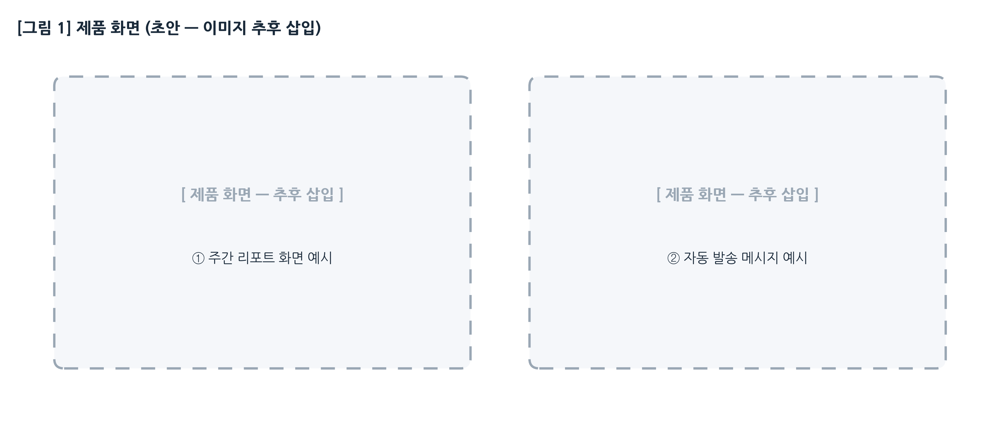
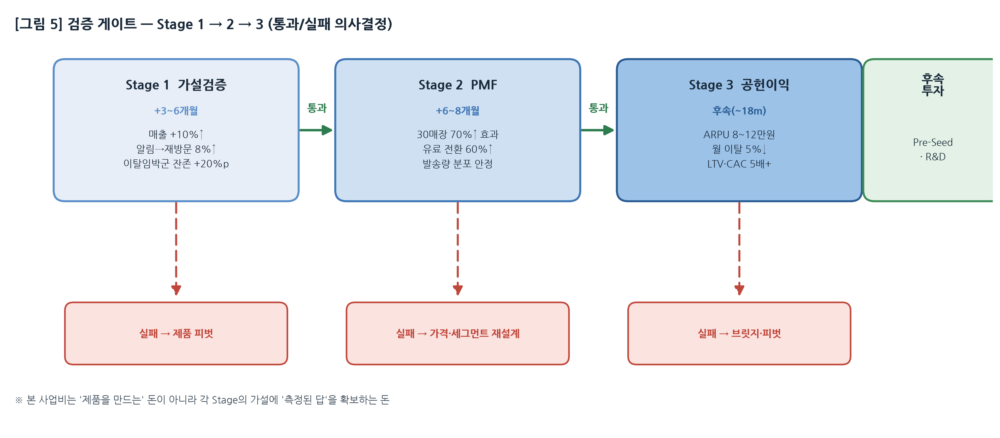
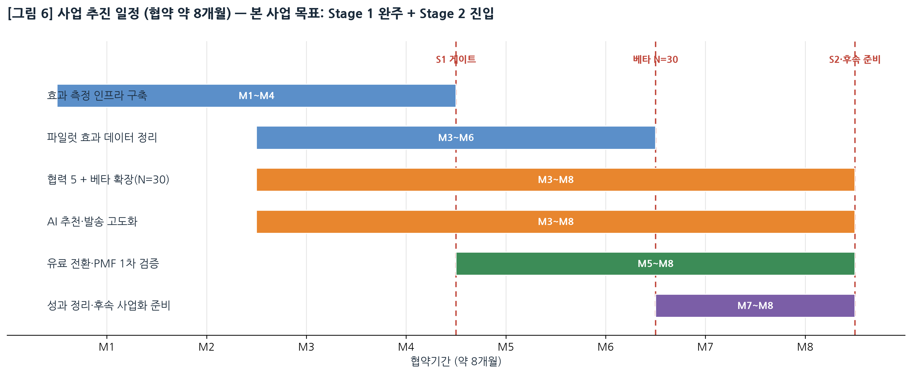

<!-- ============================================================
  예비창업패키지 PSST 사업계획서 — HWP 제출 배치판 v1.2 (가독성 편집본)
  ※ 공식 HWP 양식에 옮겨 담기 위한 '배치본'. 상세 근거는 마스터 문서 참조.
  [HWP 작성 규칙]
  - 분량: 목차·표지 제외 본문 10페이지 이내 (★엄수)
  - 본문 휴먼명조/맑은고딕 10~11pt, 줄간격 160%
  - <!--PAGE--> 위치에서 페이지 나눔 / [표·그림 N] 캡션은 하단
============================================================ -->

# 예비창업패키지 사업계획서

**창업아이템명 : 소상공인 사업장 특화 고객관리 AI 에이전트**

 

## ▣ 일반현황

| 항목 | 내용 | 항목 | 내용 |
|------|------|------|------|
| 창업아이템명 | 소상공인 사업장 특화 고객관리 AI 에이전트 | 대표자명 | 박동일 |
| 산업분야 | IT·SW / 인공지능·빅데이터 B2B SaaS | 생년월일 | 1990.03.25 |
| 기술분야 | AI 에이전트, ML(이탈·수요예측), 생성형 AI | 팀 구성 | 대표 포함 5명(예정) |
| 신청 형태 | 팀 창업 | 정부지원금(안) | 1억원 (자기부담 없음) |

 

## ▣ 창업아이템 개요(요약)

| 항목 | 내용 |
|------|------|
| **명칭·범주** | (명칭) 소상공인 사업장 특화 고객관리 AI 에이전트 (범주) 오프라인 매장 고객관리(CRM)·재방문 마케팅 자동화 SaaS |
| **개요** | 사장님이 손님 응대에만 집중하는 동안, AI가 **단골 분류 → 챙길 고객 선정 → 개인화 메시지 작성·발송 → 재방문·매출 추적**까지 자동 수행하는 *Zero-Task(사장님 행동 ≈ 주 5초)* 고객관리 에이전트. 첫 진입 시장은 **동네 정육점**. |
| **차별성** | ① 사장님 손이 안 드는 **완전 자동화(Zero-Task)** ② 특정 업종(정육)에 깊게 들어간 **수직 도메인 특화**(부분육·계절·명절·가구단위) ③ POS 거래만으로 작동 (단말 교체 불필요) |
| **이미지** | [그림 1] 제품 화면 *(초안: 빈칸, 실제 캡처 추후 삽입)* |

<!--PAGE-->

# 1. 문제인식 (Problem)

## 1-1. 창업아이템의 배경 및 필요성

#### ■ 배경 — '단골 장사'인데 단골을 모른다

정육점은 전형적 *단골 장사*로, 반복 구매에서 매출이 난다. 실제 파일럿 매장 데이터(고객 4,495명·거래 56,402건·누적 매출 약 11.3억원[^6])를 보면 **상위 13%의 핵심 단골(601명)이 누적 매출의 약 42%**를 만든다.

반대로 **전체 고객의 74%(3,343명)는 이미 이탈했거나 이탈 위험** 상태다. 매출은 소수 단골에 쏠려 있는데, 그 단골이 빠르게 새어 나간다.

동시에 LLM API 비용이 2023년 이후 **90% 이상 하락**[^3]해, 매장이 *월 몇 만원*으로 풀스택 AI 자동화를 돌릴 수 있는 첫 시점이 열렸다. 전문 도메인(법률·의료·영업)엔 특화 AI가 진입했지만, **소상공인 버티컬은 아직 비어 있다.**

#### ■ 문제 — 세 가지 구조적 부재

| 부재 | 내용 |
|------|------|
| ① **데이터 부재** | 거래 고객 4,495명이 있지만 사장님이 기억하는 단골은 약 30명(1% 미만). 단골이 장부·메신저·POS에 분산 |
| ② **감지 부재** | 방문주기·객단가가 떨어져도 모름 — 이탈을 *떠난 뒤에야* 인지 |
| ③ **실행 부재** | 누구에게 언제 무엇을 보낼지 매번 사람이 못 함 → **Zero-Task 자동화만이 해법** |

#### ■ 문제의 규모 — 파일럿 1매장 실측 세그먼트

| 세그먼트 | 고객수 | 비중 | 1인 누적구매 | 누적매출(추정) | 매출비중 |
|---------|------:|----:|----------:|-----------:|------:|
| 완전단골 | 332 | 7.4% | 1,030,152원 | 약 3.42억 | 30.2% |
| 단골 | 269 | 6.0% | 478,364원 | 약 1.29억 | 11.4% |
| 일반활성 | 551 | 12.3% | 284,890원 | 약 1.57억 | 13.9% |
| 이탈위험 | 1,088 | 24.2% | 216,459원 | 약 2.36억 | 20.9% |
| 완전이탈 | 2,255 | 50.2% | 119,040원 | 약 2.68억 | 23.7% |
| **전체** | **4,495** | 100% | (객단가 20,063원) | **약 11.3억** | 100% |

이 데이터가 말하는 세 가지 :

- **매출 집중** — 상위 13%(601명)가 누적 매출의 약 **42%**
- **이탈 심각** — 완전이탈 + 이탈위험 = 전체의 **74.4%(3,343명)**
- **가치 격차** — 단골 1명 = 이탈 고객의 **8.7배** (103만원 vs 11.9만원)

> **회복 시나리오(가설)** : 이탈위험 1,088명의 20%(약 218명)만 단골로 전환해도 **+약 0.57억원** 추가 매출 잠재. *(전환율·효과 실측은 §3-2 Stage 1)*

 

## 1-2. 창업아이템 목표시장(고객) 현황 분석

| 단계 | 정의 | 규모(추정) |
|------|------|-----------|
| **TAM** | 재방문 기반 B2C 소상공인 (음식·소매·미용·서비스) | 약 300만 업체 / 7조원 |
| **SAM** | 식품 소매·외식 | 약 90만 개 / 1조원 |
| **SOM** | 정육점 (첫 진입) | 약 57,000개소 / 2,200억원[^1] |

#### ■ 진입 순서

- **1순위 — 정육** : 단골 의존도·데이터 깊이·유통사 영업망이 가장 유리한 첫 진입 시장
- **2순위 — 식품 소매·외식** : 동일 단골 구조, 분석 엔진 재사용
- **3순위 — 미용·서비스** : 재방문 기반 B2C 전반으로 확장

#### ■ Why Now

- **AI 에이전트 시장 급성장** : 2024년 약 54억$ → 2030년 약 503억$ (CAGR 45.8%)[^4]
- **정육 소비 회복** : 1인당 육류소비 2018년 약 53.9kg → 2023년 약 62.9kg[^2]
- **정부 정책 순풍** : 소상공인 디지털 전환 바우처[^5]

#### ■ 경쟁·대체재

- 종이장부·기억 → 단골의 1~2%만 관리
- 메신저 단체발송 → 개인화·효과측정 없음
- 대형 수평 SaaS → 정육 특화·Zero-Task 부재
- 종합 POS 모듈 → 단말 교체비 300~500만원

> → *업종 특화 × 완전 자동화*의 교집합은 **시장에 비어 있다.**

<!--PAGE-->

# 2. 실현가능성 (Solution)

## 2-1. 창업아이템 현황(준비 정도)

> **아이디어가 아니라 '실매장 가동' 단계.** *"되는지 모르는 것을 만드는"* 사업이 아니라 *"되는 것을 측정·확장하는"* 사업이다.

| 구성요소 | 현황 | 구성요소 | 현황 |
|----------|:---:|----------|:---:|
| POS 거래 수집 | ✅ 가동 | 재방문·매출 추적 | 🔧 구축 중 |
| 단골 자동 분류(5단계) | ✅ 가동 | 이탈 예측 모델 | 🔧 고도화 |
| 개인화 메시지 생성·발송 | ✅ 가동 | 재고분석·발주제안 | 🔜 예정 |

#### ■ 작동 증거

- 정육점 1개소 파일럿 가동 (2024.04~)
- 거래 56,402건·고객 4,495명 자동 세분화
- 사장님 일상 사용 중

#### ■ 정직 공개 (아직 미측정)

- 도입 전/후 매출효과, 재방문 전환율, 제품가치 가설(+15% / −50%)
- → 본 사업 **Stage 1~2에서 실측** 예정

#### ■ 보유 자산

- 가동 중인 제품 워크플로
- 정육 도메인 데이터 (거래 5.6만 건)
- 협력 유통사 영업망 (5개 점포 합의)
- 팀 역량 (SaaS 0→1 · AI 박사급 · 도메인 자문)

 

## 2-2. 창업아이템 실현 및 구체화 방안

#### ■ 작동 방식 — AI 진단 → 사장님 OK → AI 실행 (사장님은 'OK'만)

1. 앱 + POS 연동 (5분, 1회성)
2. 단골 명단 자동 누적
3. **① AI 진단** — 지금 누구에게 어떤 메시지를 보낼지 판단 → 챙길 단골 선정 + 메시지 제안
4. **② 사장님 OK** — AI 제안 확인·승인 (탭 1번)
5. **③ AI 실행** — 승인 고객에게 LLM 개인화 메시지 발송
6. 재방문·매출 추적 → 주간 리포트 1장 (주 5초 확인)

> 재고 프로모션·이탈 쿠폰도 동일하게 *진단 → OK → 실행*. 승인 게이트로 오발송·민원 리스크를 낮춘다.

#### ■ 시스템 아키텍처 [그림 2]

#### ■ 핵심 기능 3축

- **축 1. 데이터 기반 단골관리** — 세그먼트 분류·이탈 예측·개인화 메시지
- **축 2. 재고 기반 마케팅** — 과재고 부위 프로모션·신선도 추천
- **축 3. 판매 예측 발주 제안** — 단골 패턴 + 계절·명절 변수

#### ■ 기술 차별점

- 개인별 방문주기 기반 *이탈 예측*
- 부분육·용도·관계 톤 *정육 특화 메시지*
- 자동발송 *안전 가드레일* (업종별 누적 = 진입장벽)
- **스택** : React Native / Python·FastAPI·PostgreSQL·Redis / 이탈예측 ML + LLM / 알림톡·LMS·이메일

#### ■ 차별화·경쟁우위

- 수직 도메인 데이터 해자 + Zero-Task 운영 해자
- 사장님 직접 가입 (POS 교체 불필요)
- 동네 클러스터 네트워크 효과
- *대기업이 못 하는 이유* — 동네 ARPU(월 10만원)는 대기업 영업 ROI 불성립, 정육 특화 데이터 부재, 사장님의 대기업 데이터 불신

#### ■ 실현 리스크 · 대응

| 리스크 | 대응 |
|--------|------|
| POS 연동 편차 | 범용 연동 + 주요 POS사 PoC |
| 자동발송 민원 | 안전 가드레일 + 사장님 승인 게이트 |
| 효과 미검증 | Stage 게이트로 조기 측정 |
| 개인정보·규제 | 동의 체계 + 관련 법규 준수 |

<!--PAGE-->

# 3. 성장전략 (Scale-up)

## 3-1. 비즈니스 모델 및 사업화 추진 전략

#### ■ 수익 모델

- Basic 구독 **월 33,000원** + 메시지 **건당 33원** (+ 장기 유통 중개)
- 예상 ARPU **월 8~12만원**
- 제품가치 가설 : 매출 **+15%** / 마케팅·재고비 **−50%** *(Stage 1 실측)*

#### ■ 단위경제 & 진입 채널

| 단위경제(가설) | 값 | GTM 채널 | 비중 |
|------|------|------|:----:|
| Gross Margin | 75~80% | 직판 | 30% |
| CAC | 5~9만원 | 파트너 유통사(5점포 즉시) | 20% |
| 월 이탈률 | 3~5% | POS사 협업 | 20% |
| LTV / CAC | 5배+ | 조합·협회 | 10% |
| 회수기간 | 1~3개월 | 정부 바우처 | 20% |

 

## 3-2. 생존율 제고를 위한 노력 — 단계별 검증 게이트

> 본 사업비는 *제품을 만드는* 돈이 아니라 **핵심 가설에 '측정된 답'을 확보**하는 돈. 단계 통과/실패에 따라 확장·재설계·피벗을 결정한다.

| 시점 | 단계 | 검증 핵심질문 (통과기준 가설) | 통과 / 실패 |
|------|------|------|------|
| +3~6m | **S1 가설검증** | 매출 +10%↑ / 재방문 8%↑ / 이탈임박군 잔존 +20%p | 베타 가속 / **피벗** |
| +6~8m | **S2 PMF** | 30매장 70%↑ 효과 / 유료전환 60%↑ | 유료 GTM / 재설계 |
| (후속) | **S3 공헌이익** | ARPU 8~12만 / 월이탈 5%↓ / LTV·CAC 5배+ | 후속투자 / 브릿지 |

 

## 3-3. 사업 추진 일정 및 자금 운용 계획

#### ■ 추진 일정 (협약 약 8개월) [표 7]

| 추진 내용 | M1–2 | M3–4 | M5–6 | M7–8 |
|-----------|:--:|:--:|:--:|:--:|
| 효과 측정 인프라 | ● | ● | | |
| 파일럿 효과 데이터 정리 | | ● | ● | |
| 협력 5 + 베타 확장(N=30) | | ● | ● | ● |
| AI 추천·발송 고도화 | | ● | ● | ● |
| 유료 전환·PMF 1차 검증 | | | ● | ● |

#### ■ 정부지원사업비 집행계획 (1억원) [표 8]

| 비목 | 금액(원) | % | 용도 |
|------|--------:|:--:|------|
| 외주용역비 | 35,000,000 | 35 | AI 모델·POS 연동·발송 인프라 |
| 광고선전비 | 25,000,000 | 25 | 베타 확보·협회·바우처 채널 |
| 인건비(직원) | 15,000,000 | 15 | 개발·운영 (규정 내) |
| 지급수수료 | 10,000,000 | 10 | 자문·서버/SW·발송비 |
| 재료비·기계장치 | 8,000,000 | 8 | 측정·테스트 기기 |
| 창업활동비·여비 등 | 7,000,000 | 7 | 시장조사·기타 |
| **합계** | **100,000,000** | 100 | 정부지원금 1억 (자기부담 없음) |

> **기타 자금 조달** : 사업 종료 후 정부 R&D(디딤돌 등)·민간 초기투자(Pre-Seed)·매출(유료 전환) 자체 운영자금으로 후속 단계 추진.

#### ■ 시장진입 성과 목표 (정량) [표 9]

| 지표 | 사업종료(M8) | +1년 | +3년 | +5년 |
|------|:--:|:--:|:--:|:--:|
| 도입 매장(누적) | 30 | 100~150 | 600~1,000 | 5,000+ |
| 매장당 매출효과 | +10%↑ 실측 | +15% | — | — |
| ARR | — | 1~1.5억 | 8~13억 | 100억+ |
| 누적 고용 | 5명 | 10명 | 15명 | 40명 |

<!--PAGE-->

# 4. 팀 구성 (Team)

## 4-1. 대표자 및 팀 역량

#### ■ 대표자

- **박동일** (1990.03.25) — 회계학 전공
- 사업 운영·재무·자금집행 총괄, 대외 협력
- *예비창업의 흔한 실패요인(자금·관리 부실)을 운영·재무 역량으로 보완*

#### ■ 팀원 (실명 제외, 이력 기준)

- **제품·기술 총괄** — B2B SaaS 기업 CTO 약 8년 (0→1 전 과정)
- **AI·데이터 총괄** — 해외대 빅데이터 박사급
- **제품·UX 총괄** — PO 경력, 이공계 석·박사
- **현장·도메인 자문** — 경영학 박사, 정육 유통사 사외이사

#### ■ 역할분담 (R&R) [표 10]

| 기능 | 대표 | 제품·기술 | AI·데이터 | 제품·UX | 자문 |
|------|:--:|:--:|:--:|:--:|:--:|
| 경영·자금 | ◎ | | | | |
| 제품·아키텍처 | | ◎ | ○ | ○ | |
| AI·이탈예측 | | ○ | ◎ | | |
| 메시지·UX | | | ○ | ◎ | ○ |
| 현장·영업망 | ○ | | | | ◎ |

#### ■ 강점 · 채용계획

- **강점** : 실행(SaaS 0→1) + 기술(AI 박사) + 도메인(유통사 영업망 직접 연결) + 운영(대표 재무)이 한 팀에
- **채용** : 본 사업기간 핵심 4인 + 외주 → +1년 시니어 백엔드·ML·모바일·영업 2명
- **고용** : 누적 5 → 10 → 15 → 25 → 40명

 

## 4-2. 외부 협력 및 사회적 가치

#### ■ 외부 협력

- 정육 유통사 (연 1,000억) — 5점포 영업 합의 → 베타 즉시 투입
- 정육협동조합·한우자조금 — 신뢰·확산
- 정육 POS사 1~2곳 — 연동 PoC
- 소상공인 바우처 — 도입비 보조

> → 예비창업 팀이 갖기 어려운 *영업망·신뢰·도입비 보조*를 협력으로 보완.

#### ■ 중장기 사회적 가치 (ESG)

- 기술 발전에서 소외된 소상공인에 *AI 직원*으로 기술 격차 해소
- 소상공인 매출 증대·비용 절감 → 동네 상권 생존율 제고
- 5년 누적 40명 고용
- 정육 → 식품 소매·외식 → 미용·서비스로 'AI 직원 모델' 확장

---

### 참고문헌 · 출처

[^1]: 통계청 KOSIS 「서비스업조사」 식육소매업(47212). 약 57,000개소는 추정치, 최신값 KOSIS 확정 필요.
[^2]: 한국농촌경제연구원 「식품수급표/농업전망」 — 1인당 육류소비(4대 육류) 2018 약 53.9kg → 2023 약 62.9kg.
[^3]: Epoch AI / DeepLearning.ai — 프런티어 LLM 토큰가 2023년 이후 90% 이상 하락.
[^4]: Grand View Research, "AI Agents Market"(2025) — 2024 약 54억$ → 2030 약 503억$ (CAGR 45.8%).
[^5]: 중소벤처기업부·소상공인시장진흥공단 소상공인 디지털 전환 정책. 대상·예산 연도별 공고 확인.
[^6]: 파일럿 정육점 POS 데이터(2024.04~). 원본: research/2026-06_파일럿매장_고객세그먼트.md.

<!-- ============================================================
  [제출 전 체크리스트]
  □ K-Startup 공식 HWP 양식(2026 별첨)에 본 내용 이식 — 임의양식 제출 금지
  □ 본문 10페이지 이내 / 공식 양식 안내문 삭제
  □ [그림 1] 제품 화면 실제 캡처 삽입
  □ 정육점 수(KOSIS), 파일럿 사장님 인용 동의, 바우처 수치 확정
  □ 대표자 인적사항·서명란 기입
============================================================ -->
